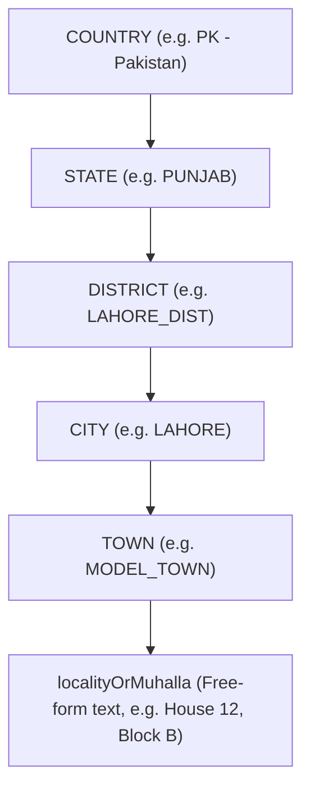
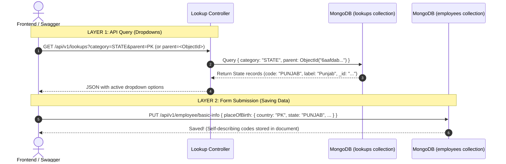

# Cascading Geographic Lookups: Architecture, Linking & Conflict Guide

This document provides a comprehensive technical guide to the **5-level cascading geographic lookup system** implemented in the Employee Management System (EMS). It details how parent-child links work, what values the frontend and backend exchange, and how duplicate names (e.g., **Punjab in Pakistan vs Punjab in India**) are handled at the database and indexing levels.

---

## 1. The 5-Level Geographic Hierarchy

The geographic model represents locations in a strict top-down parent-child dependency tree:



### Purpose of Each Level

| Level | Category | Description | Parent Entity | Example Code & Label |
| :--- | :--- | :--- | :--- | :--- |
| **1** | `COUNTRY` | Sovereign nation | *None (`parent: null`)* | `code: "PK"`, `label: "Pakistan"` |
| **2** | `STATE` | Province, State, or Administrative Territory | `COUNTRY` | `code: "PUNJAB"`, `label: "Punjab"` |
| **3** | `DISTRICT` | Administrative division within a state | `STATE` | `code: "LAHORE_DIST"`, `label: "Lahore District"` |
| **4** | `CITY` | Urban municipality or city center | `DISTRICT` | `code: "LAHORE"`, `label: "Lahore"` |
| **5** | `TOWN` | Neighborhood, sector, housing scheme, or tehsil | `CITY` | `code: "MODEL_TOWN"`, `label: "Model Town"` |
| **--** | `localityOrMuhalla` | Granular street, house, or sub-locality | *Not a lookup (free text)* | `"House 12, Street 4, Block B"` |

---

## 2. In `parent`, Do We Provide Name or Link ID?

There are **three distinct layers** in the system, and each layer uses the appropriate identifier for its specific purpose:



### Layer 1: In the Database (`lookups` Collection) $\rightarrow$ **MongoDB ObjectId (`_id`)**
In MongoDB, the `parent` field is a strict foreign key reference (`Schema.Types.ObjectId`) pointing to the parent document's `_id`:

```json
// State document in MongoDB:
{
  "_id": "6aafdab7a39be4ec76164f01",
  "category": "STATE",
  "code": "PUNJAB",
  "label": "Punjab",
  "parent": "6aafdab7a39be4ec76164e60", // <--- MongoDB _id of COUNTRY "PK"
  "isActive": true
}
```
*Why?* Fast B-Tree indexing, strict relational integrity, and rapid cascading deletions/updates.

---

### Layer 2: In API Queries (`GET /api/v1/lookups`) $\rightarrow$ **Both Supported!**
Our [`lookup.controller.js`](file:///d:/University/MERN/Employee_Managment_System/EMS/backend/src/controllers/lookup.controller.js) is built with smart resolution:

1. **Option A (By Human Code - Most Convenient)**:
   ```http
   GET /api/v1/lookups?category=STATE&parent=PK
   GET /api/v1/lookups?category=DISTRICT&parent=PUNJAB
   GET /api/v1/lookups?category=TOWN&parent=LAHORE
   ```
   The backend automatically looks up the parent code (`PK` $\rightarrow$ finds `_id`) and queries children by that `_id`.

2. **Option B (By Parent ObjectId)**:
   ```http
   GET /api/v1/lookups?category=STATE&parent=6aafdab7a39be4ec76164e60
   ```
   If a 24-character hexadecimal ObjectId is passed, it queries directly by ID without any extra query.

---

### Layer 3: In Employee Profile Payloads (`placeSelector`) $\rightarrow$ **Codes (Strings)**
When the frontend saves an employee's place of birth or address, it sends **machine-readable codes**:

```json
{
  "placeOfBirth": {
    "country": "PK",
    "state": "PUNJAB",
    "district": "LAHORE_DIST",
    "city": "LAHORE",
    "town": "MODEL_TOWN",
    "localityOrMuhalla": "House 12, Block B"
  }
}
```

#### Why store Codes instead of ObjectIds in Employee profiles?
1. **Self-Describing Data**: When reading the employee profile in MongoDB Compass or analytics pipelines, you see `"country": "PK", "city": "LAHORE"` rather than meaningless hex strings like `"6aafdab7a39be4ec76164f01"`.
2. **Decoupled from Database Migrations**: If lookups are re-seeded or migrated to another environment (Dev $\rightarrow$ QA $\rightarrow$ Prod) where `_id` values change, the employee records remain completely valid because the codes are constant.
3. **Optimized Audit Trail (SCD Type 2)**: Version diffs show clear, human-readable transitions:
   - Version 1: `city: "RAWALPINDI"`
   - Version 2: `city: "LAHORE"`

---

## 3. The "Punjab in 2 Countries" Conflict Analysis

### The Problem Scenario
- **Pakistan** has a province named **Punjab** (`label: "Punjab"`).
- **India** also has a state named **Punjab** (`label: "Punjab"`).
- Other common real-world duplicates:
  - **Hyderabad**: City in Sindh (Pakistan) vs City in Telangana (India).
  - **Georgia**: Independent nation (`COUNTRY`) vs US State (`STATE`).
  - **Washington**: State in the Pacific Northwest vs **Washington D.C.** (Federal District).

### What Happens With Current Indexing?
In [`lookup.model.js`](file:///d:/University/MERN/Employee_Managment_System/EMS/backend/src/models/lookup/lookup.model.js), line 41 defines:
```javascript
lookupSchema.index({ category: 1, code: 1 }, { unique: true });
```

If we attempt to insert:
1. Pakistan's Punjab: `{ category: "STATE", code: "PUNJAB", parent: PK_ID, label: "Punjab" }` $\rightarrow$ **Success!**
2. India's Punjab: `{ category: "STATE", code: "PUNJAB", parent: IN_ID, label: "Punjab" }` $\rightarrow$ **💥 CRASH: E11000 duplicate key error!**

MongoDB rejects the second insert because both documents share:
- `category = "STATE"`
- `code = "PUNJAB"`

---

### The Two Enterprise Solutions

| Metric | Pattern 1: Scoped / Namespaced Codes *(Recommended)* | Pattern 2: Compound Index With Parent |
| :--- | :--- | :--- |
| **Code Structure** | `PK_PUNJAB` and `IN_PUNJAB` (or ISO `PK-PB` and `IN-PB`) | Both use `code: "PUNJAB"` |
| **Unique Index** | `{ category: 1, code: 1 }` (Unchanged) | Changed to `{ category: 1, parent: 1, code: 1 }` |
| **Querying by Code** | `GET /lookups?category=DISTRICT&parent=PK_PUNJAB` (Always unambiguous) | Requires knowing the parent's `_id` because `code: "PUNJAB"` matches multiple rows |
| **Employee Record** | `state: "PK_PUNJAB"` (Globally unique, self-explanatory) | `state: "PUNJAB"` (Ambiguous unless joined with country) |
| **Global Standard** | Follows **ISO 3166-2** standard | Custom relational constraint |

---

### Recommended Pattern: Scoped Codes (ISO 3166-2 Standard)

In international systems (UN, ISO, airline reservation GDS, banking SWIFT), geographic subdivisions are namespaced by their parent code:

#### Database Lookups:
```json
// Pakistan's Punjab:
{
  "_id": "6aafdab7a39be4ec76164f01",
  "category": "STATE",
  "code": "PK_PUNJAB",     // <--- Namespaced code
  "label": "Punjab",       // <--- Display label in UI is clean "Punjab"
  "parent": "6aafdab... (PK)"
}

// India's Punjab:
{
  "_id": "6aafdab7a39be4ec76164f02",
  "category": "STATE",
  "code": "IN_PUNJAB",     // <--- Namespaced code
  "label": "Punjab",       // <--- Display label in UI is clean "Punjab"
  "parent": "6aafdab... (IN)"
}
```

#### Why This Is Superior:
1. **Zero UI Impact**: The user still sees **"Punjab"** in the dropdown. The frontend displays `item.label`.
2. **Zero Ambiguity in Backend**: If someone queries districts under `PK_PUNJAB`, the database only ever finds Pakistan's Punjab.
3. **No Collision on Cities**:
   - `PK_HYDERABAD` (Sindh, Pakistan)
   - `IN_HYDERABAD` (Telangana, India)
4. **Maintains Fast `{ category: 1, code: 1 }` Index**: Preserves high-speed in-memory cache lookup (`Map.get("PK_PUNJAB")`).

---

### Alternative Pattern: Compound Index with Parent

If you prefer keeping bare codes like `code: "PUNJAB"` for both records:

1. **Change the MongoDB Index in `lookup.model.js`**:
   ```javascript
   // Old index:
   // lookupSchema.index({ category: 1, code: 1 }, { unique: true });

   // New index (Unique only within the same parent):
   lookupSchema.index({ category: 1, parent: 1, code: 1 }, { unique: true });
   ```
2. **How MongoDB Handles It**:
   - `{ category: "STATE", parent: ObjectId("PK_ID"), code: "PUNJAB" }` $\rightarrow$ Unique key A
   - `{ category: "STATE", parent: ObjectId("IN_ID"), code: "PUNJAB" }` $\rightarrow$ Unique key B
   Both can now coexist in the same collection.

---

## 4. End-to-End Frontend Flow with Real Examples

Here is the exact step-by-step workflow of how the frontend drives cascading dropdowns for an employee profile.

---

### Step 1: Frontend Loads Countries on Form Open

#### Request:
```http
GET /api/v1/lookups?category=COUNTRY
```

#### Response (200 OK):
```json
{
  "statusCode": 200,
  "data": [
    {
      "_id": "6aafdab7a39be4ec76164e60",
      "category": "COUNTRY",
      "code": "PK",
      "label": "Pakistan",
      "sortOrder": 1,
      "parent": null
    },
    {
      "_id": "6aafdab7a39be4ec76164e61",
      "category": "COUNTRY",
      "code": "AE",
      "label": "United Arab Emirates",
      "sortOrder": 2,
      "parent": null
    },
    {
      "_id": "6aafdab7a39be4ec76164e62",
      "category": "COUNTRY",
      "code": "US",
      "label": "United States",
      "sortOrder": 5,
      "parent": null
    }
  ],
  "message": "Lookups retrieved successfully.",
  "success": true
}
```

---

### Step 2: User Selects "Pakistan" (`PK`) $\rightarrow$ Fetch States

The frontend UI listens to `onChange` of the Country dropdown. Once selected, it immediately triggers:

#### Request:
```http
GET /api/v1/lookups?category=STATE&parent=PK
```

#### Response (200 OK):
```json
{
  "statusCode": 200,
  "data": [
    {
      "_id": "6aafdab7a39be4ec76164e70",
      "category": "STATE",
      "code": "PK_PUNJAB",
      "label": "Punjab",
      "sortOrder": 1,
      "parent": "6aafdab7a39be4ec76164e60"
    },
    {
      "_id": "6aafdab7a39be4ec76164e71",
      "category": "STATE",
      "code": "PK_SINDH",
      "label": "Sindh",
      "sortOrder": 2,
      "parent": "6aafdab7a39be4ec76164e60"
    },
    {
      "_id": "6aafdab7a39be4ec76164e72",
      "category": "STATE",
      "code": "PK_ISLAMABAD",
      "label": "Islamabad Capital Territory",
      "sortOrder": 5,
      "parent": "6aafdab7a39be4ec76164e60"
    }
  ],
  "message": "Lookups retrieved successfully.",
  "success": true
}
```

---

### Step 3: User Selects "Punjab" (`PK_PUNJAB`) $\rightarrow$ Fetch Districts

#### Request:
```http
GET /api/v1/lookups?category=DISTRICT&parent=PK_PUNJAB
```

#### Response (200 OK):
```json
{
  "statusCode": 200,
  "data": [
    {
      "_id": "6aafdab7a39be4ec76164e80",
      "category": "DISTRICT",
      "code": "LAHORE_DIST",
      "label": "Lahore District",
      "sortOrder": 1,
      "parent": "6aafdab7a39be4ec76164e70"
    },
    {
      "_id": "6aafdab7a39be4ec76164e81",
      "category": "DISTRICT",
      "code": "RAWALPINDI_DIST",
      "label": "Rawalpindi District",
      "sortOrder": 2,
      "parent": "6aafdab7a39be4ec76164e70"
    },
    {
      "_id": "6aafdab7a39be4ec76164e82",
      "category": "DISTRICT",
      "code": "FAISALABAD_DIST",
      "label": "Faisalabad District",
      "sortOrder": 3,
      "parent": "6aafdab7a39be4ec76164e70"
    }
  ],
  "message": "Lookups retrieved successfully.",
  "success": true
}
```

---

### Step 4: User Selects "Lahore District" (`LAHORE_DIST`) $\rightarrow$ Fetch Cities

#### Request:
```http
GET /api/v1/lookups?category=CITY&parent=LAHORE_DIST
```

#### Response (200 OK):
```json
{
  "statusCode": 200,
  "data": [
    {
      "_id": "6aafdab7a39be4ec76164e90",
      "category": "CITY",
      "code": "LAHORE",
      "label": "Lahore",
      "sortOrder": 1,
      "parent": "6aafdab7a39be4ec76164e80"
    }
  ],
  "message": "Lookups retrieved successfully.",
  "success": true
}
```

---

### Step 5: User Selects "Lahore" (`LAHORE`) $\rightarrow$ Fetch Towns

#### Request:
```http
GET /api/v1/lookups?category=TOWN&parent=LAHORE
```

#### Response (200 OK):
```json
{
  "statusCode": 200,
  "data": [
    {
      "_id": "6aafdab7a39be4ec76164ea0",
      "category": "TOWN",
      "code": "MODEL_TOWN",
      "label": "Model Town",
      "sortOrder": 1,
      "parent": "6aafdab7a39be4ec76164e90"
    },
    {
      "_id": "6aafdab7a39be4ec76164ea1",
      "category": "TOWN",
      "code": "GULBERG",
      "label": "Gulberg",
      "sortOrder": 2,
      "parent": "6aafdab7a39be4ec76164e90"
    },
    {
      "_id": "6aafdab7a39be4ec76164ea2",
      "category": "TOWN",
      "code": "DHA_LHR",
      "label": "DHA Lahore",
      "sortOrder": 5,
      "parent": "6aafdab7a39be4ec76164e90"
    }
  ],
  "message": "Lookups retrieved successfully.",
  "success": true
}
```

---

### Step 6: User Selects "Model Town" & Submits Form (Basic Info)

The user chooses `MODEL_TOWN` and types `"House 12, Block B"` in the `localityOrMuhalla` field. The frontend submits the final payload:

#### Request:
```http
PUT /api/v1/employee/basic-info
Content-Type: application/json
```
```json
{
  "fullName": "Muhammad Ali",
  "gender": "MALE",
  "maritalStatus": "MARRIED",
  "dateOfBirth": "1995-05-12",
  "placeOfBirth": {
    "country": "PK",
    "state": "PK_PUNJAB",
    "district": "LAHORE_DIST",
    "city": "LAHORE",
    "town": "MODEL_TOWN",
    "localityOrMuhalla": "House 12, Block B"
  },
  "notes": "Verified place of birth"
}
```

#### Response (200 OK):
```json
{
  "statusCode": 200,
  "data": {
    "_id": "6aafdab7a39be4ec76164fb0",
    "employeeId": "6aafdab7a39be4ec76164e01",
    "fullName": "Muhammad Ali",
    "gender": "MALE",
    "maritalStatus": "MARRIED",
    "dateOfBirth": "1995-05-12T00:00:00.000Z",
    "placeOfBirth": {
      "country": "PK",
      "state": "PK_PUNJAB",
      "district": "LAHORE_DIST",
      "city": "LAHORE",
      "town": "MODEL_TOWN",
      "localityOrMuhalla": "House 12, Block B"
    },
    "version": 1,
    "isCurrent": true,
    "isDeleted": false,
    "createdAt": "2026-09-27T13:00:00.000Z"
  },
  "message": "Basic Info saved successfully.",
  "success": true
}
```

---

## 5. Summary Cheat Sheet for Developers

| Question | Answer |
| :--- | :--- |
| **What does MongoDB store in `parent`?** | The **`ObjectId`** of the parent lookup record (`_id`). |
| **What can frontend pass in query `?parent=`?** | **Either** the parent `ObjectId` **OR** the parent `code` (`PK`, `PUNJAB`, `LAHORE`). |
| **What does `placeSelector` store in Employee?** | The **human-readable codes** (`country: "PK"`, `city: "LAHORE"`). |
| **Does duplicate name (Punjab in PK vs IN) crash the DB?** | **Yes**, if both use `code: "PUNJAB"` under `{ category: 1, code: 1 }`. |
| **How to prevent the duplicate crash?** | Use scoped codes (`PK_PUNJAB` vs `IN_PUNJAB`) with identical display labels (`"Punjab"`), **OR** compound index `{ category: 1, parent: 1, code: 1 }`. |
